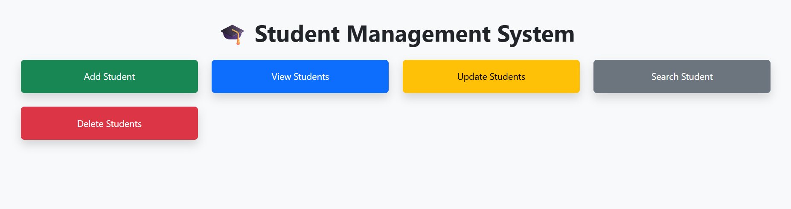
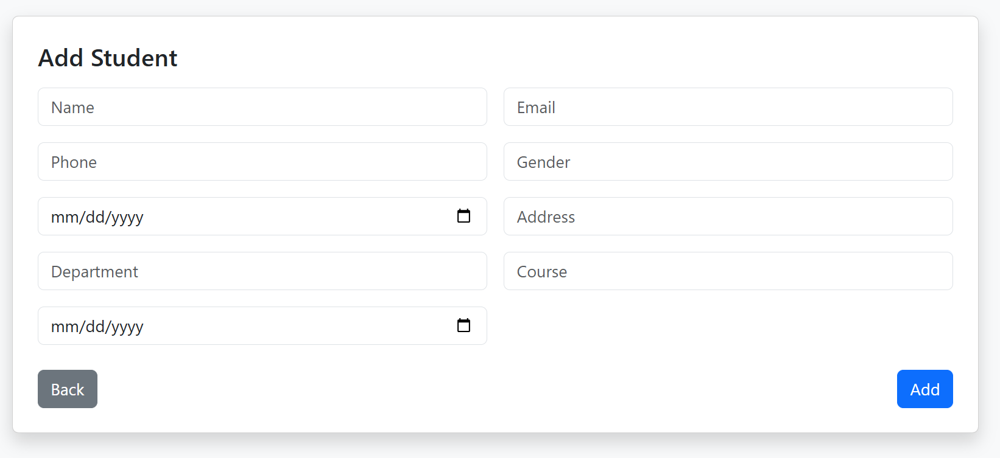
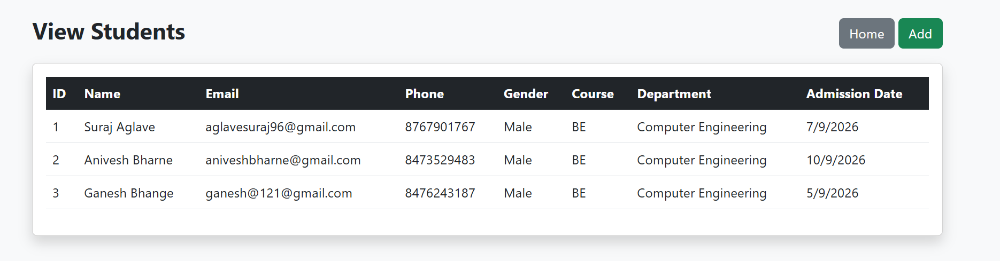
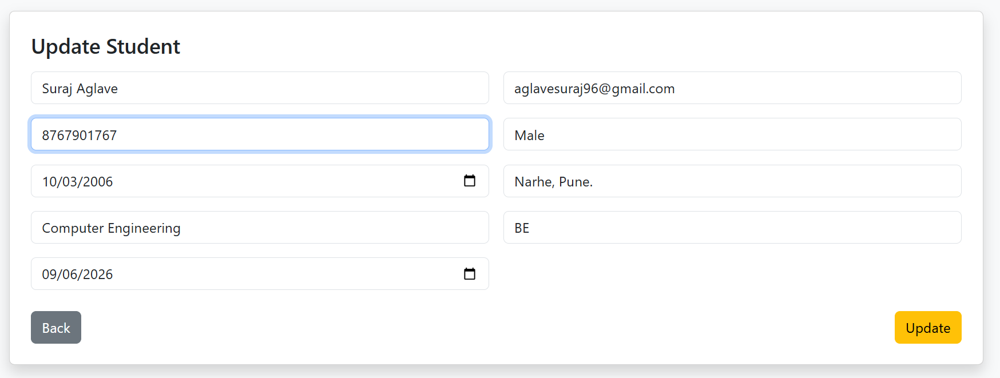
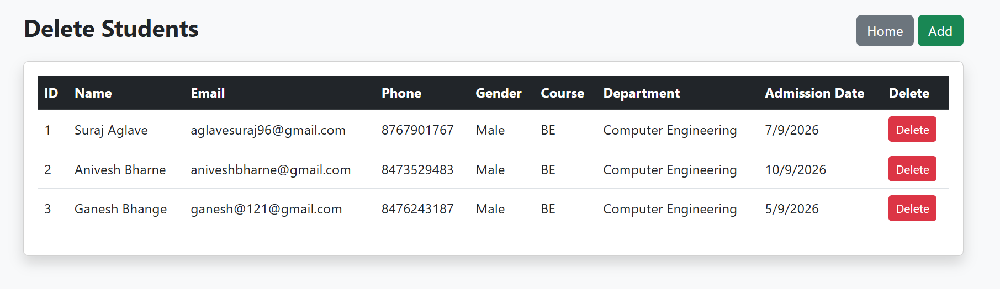
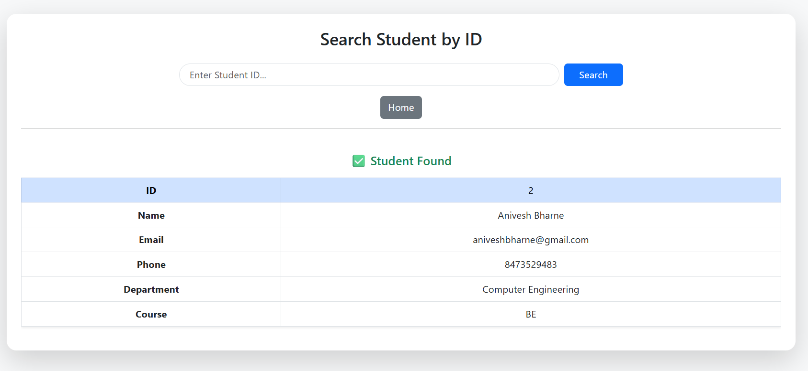

#  Student Management System

A web-based **Student Management System** built using **Node.js, Express.js, MySQL, and EJS**.
This project allows users to manage student records with full **CRUD operations** in a simple and user-friendly interface.

---

##  Features

*  Add new student
*  View all students
*  Update student details
*  Delete student
*  Search student by ID
*  Responsive UI using Bootstrap

---

##  Tech Stack

* Node.js
* Express.js
* MySQL
* EJS
* Bootstrap

---

##  Screenshots

###  Home Page



###  Add Student



###  View Students



###  Update Student



###  Delete Student



###  Search Student



---

##  Installation

```bash
git clone https://github.com/YOUR_USERNAME/Student-Management-System.git
cd Student-Management-System
npm install
```

---

## ▶ Run Project

```bash
node app.js
```

---

##  Database Setup

1. Create MySQL database:

```sql
CREATE DATABASE student_db;
```

2. Create table:

```sql
CREATE TABLE students (
    id INT AUTO_INCREMENT PRIMARY KEY,
    name VARCHAR(100),
    email VARCHAR(100),
    phone VARCHAR(15),
    gender VARCHAR(10),
    dob DATE,
    address TEXT,
    department VARCHAR(100),
    course VARCHAR(100),
    admission_date DATE
);
```

---

##  Environment Variables

Create a `.env` file in root:

```env
DB_HOST=localhost
DB_USER=db_user
DB_PASSWORD=db_password
DB_NAME=student_db
```

---

##  Author

**Suraj Aglave**

---

## Support

If you like this project, give it a ⭐ on GitHub!
